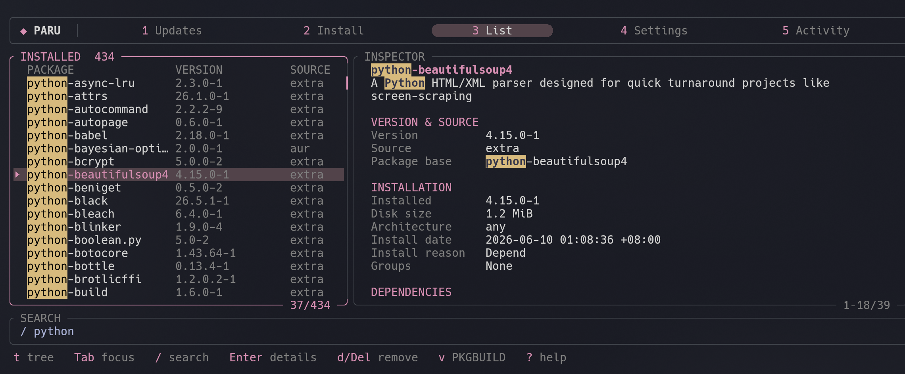

# Paru

## Paru TUI fork



Native Rust terminal interface with separate repository/AUR update panels, package search, and per-package-base proxy settings. The original CLI remains available.

```sh
cargo build --release --features tui --bin paru-tui
./target/release/paru-tui
```

See the upstream [README](https://github.com/Morganamilo/paru/blob/master/README.md) for Paru help.
